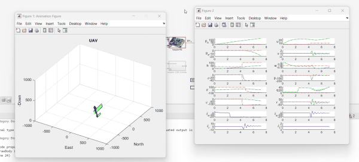
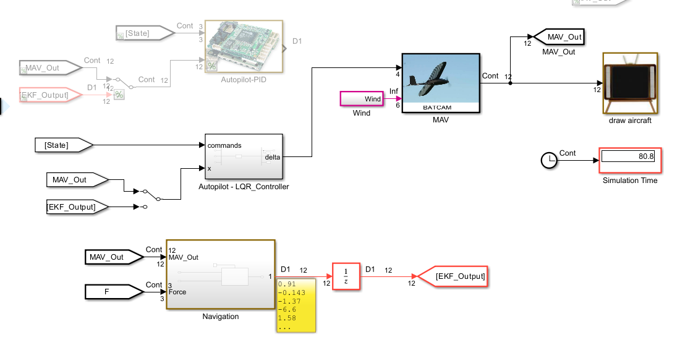

# MKT6110 - Final Exam

This project contains the flight control simulation developed for the **MKT6110 Final Exam**. The simulation includes implementations of both **PID** and **LQR** controllers using a fixed-wing MAV model.

---

## 🚀 Getting Started

Open MATLAB and initialize system parameters by running:

```matlab
param
```

Then launch the Simulink model:

```
mav_project.slx
```

---

## ⚙️ Controllers

### 1. 📌 PID Controller (Default)

By default, the Simulink model runs with the **PID controller**. The navigation module is also active during this mode.

<p align="center">
  
</p>

**▶️ Simulation Preview (GIF):**  
<p align="center">
  
</p>

---

### 2. 🎯 LQR Controller

After verifying the performance of the PID controller, the **LQR (Linear Quadratic Regulator)** controller can be activated for improved stability and response.

<p align="center">
  
</p>

---

## 📁 Project Structure

```
├── mav_project.slx
├── param.m
├── ------
```

---

## 📝 Notes

```bash

```
